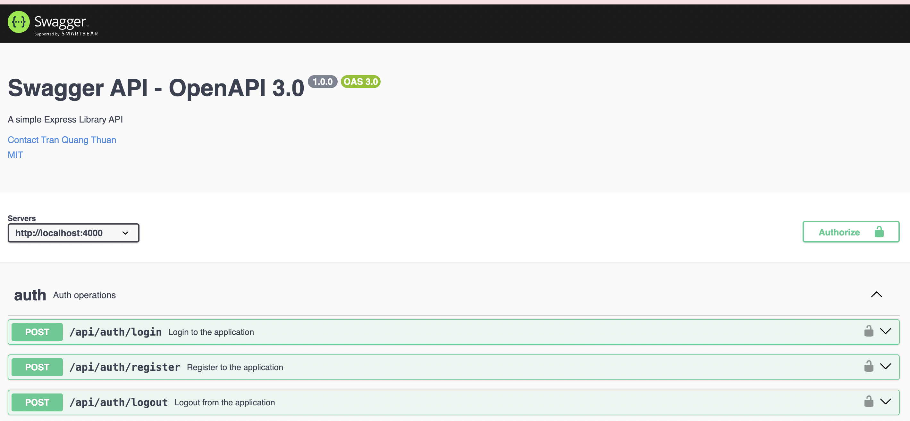

# TWITTER API
Twitter API is comprehensive and user-friendly RESTful API designed to provide developers with easy access to related information of social network. If you are building a social network, Twitter API offers robust and reliable endpoints to fetch data on user's infor, posts and more.
## Techonologies and frameworks
* TypeScript
* Nodejs
* ExpressJs
* MongoDB
## INSTALL

### Required
Before you continue, ensure you meet the following 
requirements:
* You have installed [Docker](https://www.docker.com/products/docker-desktop/).
* You have installed [Git](https://git-scm.com/downloads).
* Clone project

Use these command to install this project.
```bash
git clone https://github.com/tranquangthuan1211/TWITTER_API
```
```bash
cd Twitter-API
```
* Run project with command
```bash
docker compose up
```
Wait a moment and here is the result if you installed successfully with [this url](http://localhost:4000/api-docs/#/default)


